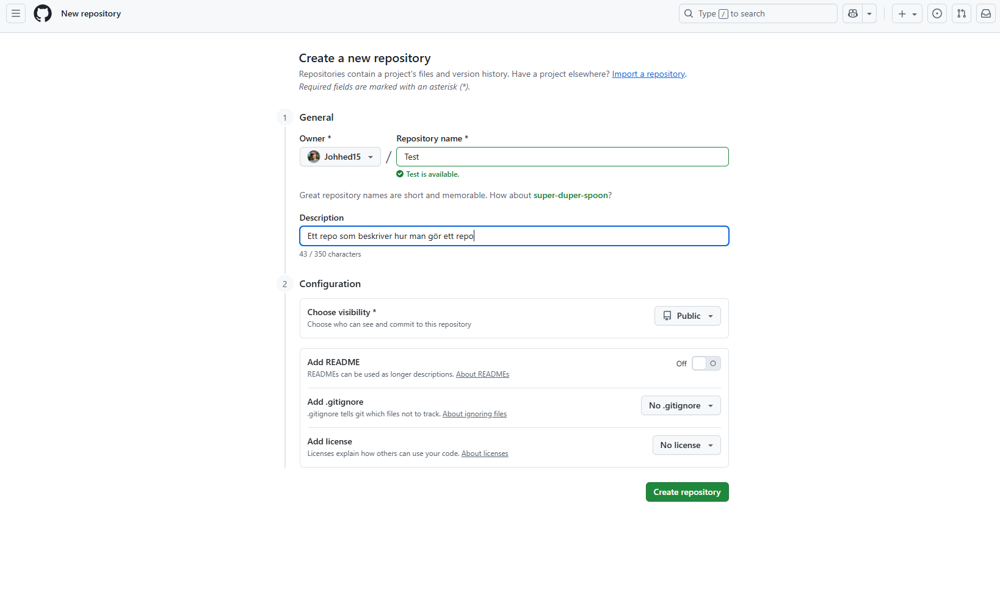
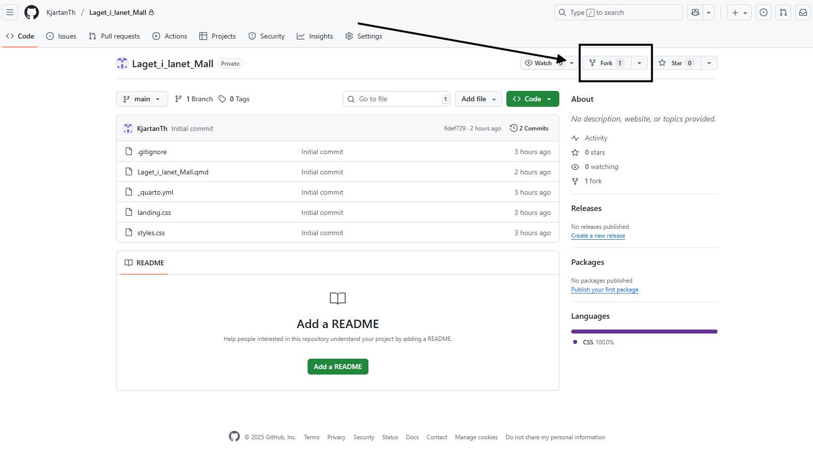

# Github-intro

<div align="center">
  
</div>

```{html}
# regionens bilder kan lätt importeras utan att laddas ned med tex: 

<div align="center">
  
</div>

```


# 1. Konfigurera Git på datorn


Innan du kan använda Git behöver du koppla det till ditt GitHub-konto:

```{r}
# Ange ditt användarnamn
git config --global user.name "githubkonto"

# Ange din e-post
git config --global user.email "hej123@mail.se"
```

*Tips:*

- Kontrollera inställningarna med git config --list

- Om du får felmeddelandet "fatal: not in a git repository", betyder det att du inte är i ett Git-repo.

- Gå till mappen med cd <mappnamn> eller skapa ett nytt repo med git init

# 2.1 Skapa ett repo på github


**När du skapar ett repo på Github eller genom Rstudio så finns valet att skapa en .gitinore - fil, i denna fil ska alltid *.Rproj alltid skrivas, detta gör att Rproj- filen på datorn inte laddas upp till github utan behålls lokalt.**


<<<<<<< HEAD
<div align="center">
  
</div>

# 2. Koppla till ett befintligt GitHub-repo
=======
# 2.2 Koppla till ett befintligt GitHub-repo
>>>>>>> 391a747ae31572fbc0dfc7d6c7b2736005665d8d

Starta med att göra en fork(om du inte äger repot) på repot så att den läggs in i dina repositories på github: 
<div align="center">
  
</div>


Ägaren av repot måste lägga till dig som samarbetare:

Gå till repot på GitHub  
➡ Klicka på **Settings**  
➡ Välj **Collaborators**  
➡ Klicka på **Add people**  
➡ Skriv in ditt användarnamn

- Du får nu ett mail med en inbjudan som du accepterar

Öppna RStudio:

1. New Project → Version Control → Git

2. Klistra in URL:en till GitHub-repot

3. Välj mappen på datorn där du vill ha projektet och klicka Create Project

Nu laddas alla filer från GitHub-repot ner till din dator

README filen som skapas är "presentationen" för repot och beroende på vad repot ska användas till så används den ofta till att beskriva hur funktionerna/filerna i repot används och fungerar.


# 3. Ändra och ladda upp filer 


Detta steg förutsätter att du är i ett R-project

## Steg i RStudio:

1. Skapa eller redigera filer

2. I fliken Git:

   - Markera de filer du vill ladda upp
   
   - Klicka Commit
   
   - Skriv en beskrivande commit-meddelande, t.ex. "Lagt till analys av data"
   
   - Klicka Commit och sedan Push

## Alternativt via terminal

```{r}
git add . # punkten betyder alla ändringar i nuvarande mapp och undermappar, byt mot scriptnam.R för specifik fil
git commit -m "Kort beskrivning av ändringar"
git push

```


Vanliga fel och lösningar:

- error: failed to push some refs → Din lokala branch är bakom remote → Kör git pull --rebase innan git push

- fatal: not a git repository → Du är inte i ett repo → Navigera till rätt mapp eller skapa repo med git init


# 4. Skapa ett nytt Quarto Website-repo


I RStudio: New Project → New Directory → Quarto Website

Fyll i:

- Namn på projektet

- Plats på datorn

- Klicka i Create a Git repository

Nu kan du använda Git precis som ovan för att versionhantera din Quarto-webbplats


# 5. Generella tips

**När du skapar ett repo på Github eller genom Rstudio så finns valet att skapa en .gitinore - fil, i denna fil ska alltid *.Rproj alltid skrivas, detta gör att Rproj- filen på datorn inte laddas upp till github utan behålls lokalt.**

- Använd .gitignore: Lägg till filer du inte vill versionhantera (t.ex. stora dataset, temporära filer)

- Commit ofta: Små, tydliga commits gör det lättare att felsöka

- Branching: Skapa en branch för nya funktioner eller experiment git checkout -b ny-funktion

- Pull innan push: Håll ditt repo uppdaterat med git pull


```{r}
# Visualisera repo-status
git status

# Se commit-historik
git log --oneline --graph --all

# Ångra ändringar innan commit
git checkout -- <filnamn> # <filnamn> = vald fil

# Ta bort filer från Git men behåll lokalt
git rm --cached <filnamn>
```


Tips:

- Kontrollera alltid med git status innan du committar eller pushar

- Om du får konflikter vid git pull, lös dem innan du pushar

- Små, tydliga commits gör felsökning enklare

- Varje commit är en ny sparning vilket tar minne och kan göra historiken tung, hitta en balans!

- Lägg till kommentarer i commit-meddelanden så att andra förstår dina ändringar

- Om man tar bort/ändrar en fil som inte ska ändras så går det att backa till en tidigare version även efter commit och push: 


```{r}
git log --oneline --graph # är bra för att visualisera historiken.

# Backa hela projectet till specific commit
git revert <commit-hash> #  <commit-hash> == referens till specific commit

# om det inte räcker: tar bort alla lokala ändringar som ej är comittade, ej comittade ändringar raderas permanent!!
git reset --hard <commit-hash>

git clone <url>          # Klona ett repo första gången
git stash               # Spara temporära ändringar
git stash pop           # Återställ sparade ändringar
git diff               # Se ändringar innan commit
```


## konflikt när flera jobbar i samma repo och merge behövs

### Alternativ 1: Via GitHub (pull request)

- Gå till GitHub → ditt repo → “Pull Requests” → “New Pull Request”

- Välj din branch och main/master som bas

- Skapa pull request → GitHub visar eventuella konflikter → merge när allt är klart

### Alternativ 2: Via terminal

```{r}

git checkout main # byt branch till main
git pull           # Hämta senaste main
git merge ny-funktion # slår ihop ändringar från branchen "ny-funktion"
```


- Om det uppstår konflikter måste du redigera filerna manuellt

- Ta bort konfliktmarkeringarna och behåll rätt kod

- Lägg till filen och committa merge:

```{r}
git add <filnamn> 
git commit

```

- Push:a sedan main till remote:

```{r}
git push
```


# 4. Konflikter

Git visar konflikter med markeringar i filerna:

```{r}
<<<<<<< HEAD
din kod
=======
annans kod
>>>>>>> ny-funktion
```


- Lös konflikten genom att ta bort markeringarna och behålla rätt kod
- Kör sedan:

git add <filnamn>
git commit


# Tips för teamsamarbete

- Pull ofta innan du börjar jobba → mindre risk för konflikter

- Använd små, tydliga commits → lättare att läsa historik och merga

- Kommunicera i teamet om ändringar som påverkar samma filer


